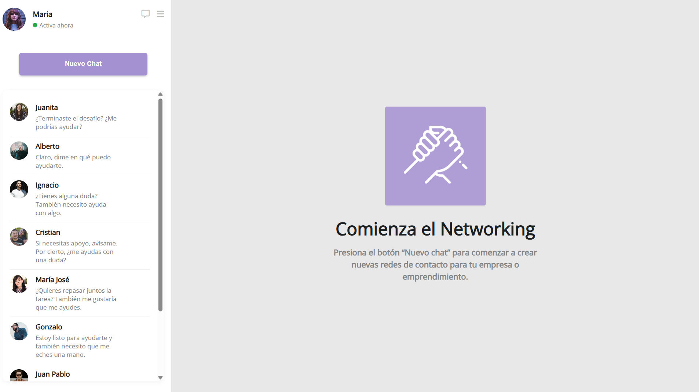

# 💬 Sistema de Mensajería

Este proyecto consiste en la maquetación de un sistema de mensajería utilizando únicamente **HTML y CSS**, con un enfoque especial en **Flexbox** para el diseño y posicionamiento de elementos.

---

## 🎯 Objetivo

Simular una aplicación de mensajería con:
- Una columna de contactos con imágenes, nombres y mensajes.
- Un área principal con un mensaje de bienvenida y un logo.
- Un botón para iniciar un nuevo chat.
- Un estado de usuario con íconos.

---

## 🧰 Tecnologías usadas

- HTML5
- CSS3
- Flexbox
- [Font Awesome](https://fontawesome.com/) para los íconos

---

## ✅ Requisitos cumplidos

1. ✅ Dos columnas posicionadas con Flexbox.
2. ✅ Contenido principal centrado con imagen y textos.
3. ✅ Contactos listados verticalmente con Flex.
4. ✅ Cada contacto tiene imagen y texto alineados con Flex.
5. ✅ Botón "Nuevo Chat" centrado y posicionado con Flex.
6. ✅ Estado de usuario al tope con íconos, imagen y nombre.

---

## 📸 Vista previa del proyecto

---

## 👥 Créditos

Este proyecto fue realizado por:

**Medardo Enrique Sánchez Sequera**  
💻 TSU en Informática — Especialista en Ethical Hacking y desarrollo Full Stack  
🔗 [LinkedIn: Medardo Sánchez](https://www.linkedin.com/in/medardo-sanchez-a57ba2240/)

---

## 🤝 ¿Quieres ayuda?

Varios contactos en este sistema me han pedido ayuda para comenzar sus propios proyectos 😄  
Si tú también necesitas una mano con **HTML, CSS, ciberseguridad o desarrollo Full Stack**, ¡no dudes en escribirme!
